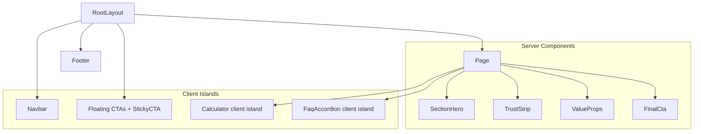

# ELRIX ENERGY 2.0 — Complete Professional Website Audit

> Read-only audit. All findings reference exact paths and line numbers. Scores are calibrated to a top-tier 2026 web agency rubric for premium B2C/B2B lead-gen sites.

---

## 1. Executive Summary

### Scorecard (0–100)

- **Overall website quality: 62 / 100** — Solid Next.js 15 foundation and decent SEO scaffolding, undermined by visible amateur tells: monochrome "Sleek Black" palette, divitis + 150+ inline styles, broken image references, copy-pasted pages, FAQ accordions built on `<div>` instead of `<button>`/`<details>`, and zero `:focus-visible` styles.
- **UI/UX: 58 / 100** — Clear funnel and good CTA density, but hierarchy collapses because `--primary === --secondary === #000`. Hero typography uses confusing black-on-dark-gradient ("Eliminate / Premium Solar") that disappears on the background.
- **Performance: 70 / 100** — Lean stack, `next/font` with swap, hero is AVIF; **but** Home component is 400-line client bundle, every page is `"use client"` (even static ones like Projects, Services), `` instead of `next/image` everywhere except Navbar/Footer, infinite hero `background-position` animation, and 14 CSS files imported globally on every route.
- **Accessibility: 48 / 100** — WCAG 2.2 fails on focus visibility (no `:focus-visible` ring on chrome), FAQ pattern (`role="button"` on `<div>` with `<h3>` inside), eligibility toggles missing `aria-pressed`, form status messages not announced (`aria-live` absent), heading-level skips on Contact/Financing/About, hover-only nav dropdowns inaccessible to keyboard.
- **SEO: 72 / 100** — Sitemap/robots/JSON-LD/`generateStaticParams` all present, hreflang/canonicals set; **but** ~12/16 titles exceed 60 chars, ~10/16 descriptions exceed 160, every page shares one OG image, child-page Twitter cards inherit homepage text, sitewide `HomeAndConstructionBusiness` JSON-LD references `/logo.png` that does not exist in `public/`.
- **Code quality: 55 / 100** — TypeScript opted-out in event handlers (`(e) =>` untyped), `useState(null)` without generics, two orphan components (`Calculator.tsx`, `BlogPost.tsx`), dead `pricingData` constants in two files, stale blog previews on Home that don't match `blogData.ts`, two slightly different `calculateSolar` implementations.
- **Mobile responsiveness: 65 / 100** — Sensible 768 px and 992 px breakpoints; but only **4 of 17** stylesheets use a sub-mobile (480 px) breakpoint, hero on city pages converts to 6 rem padding (huge), tap targets under 44 px on FAQ chevrons and dropdown links, sticky CTA + Floating buttons + Navbar cause stacking conflicts on mobile.
- **Conversion / readability: 64 / 100** — Strong subsidy hook (₹78,000), eligibility quiz, EMI calculator, prefill `?bill=`, WhatsApp deep-link. But hero hides half the headline behind black-on-dark gradient, **Home admits "we have no reviews yet"** in the trust section, `/projects` is "Coming soon", footer admits proprietor name ("Made by Bhaswanth Vommena") which weakens premium brand perception.
- **Production readiness: 60 / 100** — Builds and ships, GA is live, schema.org is wired. But broken images (5 referenced, 0 present), no error/loading/not-found boundaries, no `viewport`/`manifest`/`themeColor` metadata, no error monitoring, no rate-limit/captcha on the contact form, the FormSubmit endpoint hard-codes the inbox in client source (visible to scrapers).

### Biggest strengths
- Clean App Router structure, per-route metadata, dynamic blog with `generateStaticParams` + `notFound()`.
- Schema.org coverage: `HomeAndConstructionBusiness` (root), `LocalBusiness` (4 cities), `BreadcrumbList` (4 service subs), `FAQPage` (home), `BlogPosting` (per post).
- CSS custom-property design tokens (`--primary`, `--shadow-*`, `--radius-*`, `--transition`) and shared `.btn` utilities.
- `Reveal` IntersectionObserver pattern is lightweight (no Framer Motion).
- Calculator → WhatsApp/Contact handoff with prefilled body is a strong conversion mechanic.

### Biggest weaknesses
- **Visual identity** is monochrome black; no brand accent — primary and secondary tokens both `#000000` (`app/styles/index.css` L2, L5).
- **Hero readability**: alternating `.hero-word-dark` (black) and `.hero-word-light` (white) words on a 68%-to-24% dark gradient — the black words become invisible (`app/styles/Home.css` L85–91).
- **Component copy-paste**: TrustStrip, FAQ accordion, EMI calculator, page header are forked instead of shared.
- **5 missing PNG assets** (`md-photo.png`, `residential_solar.png`, `commercial_solar.png`, `industrial_solar.png`, `solar_maintenance.png`, plus `logo.png` referenced in Navbar/Footer/schema).
- **a11y debt**: FAQ pattern, hover-only dropdowns, no focus ring, no `aria-live` on form/calc results.

### Highest-priority fixes (V2 — do first)
1. Restore real **brand colour** (`--secondary` ≠ `--primary`) and replace `.hero-word-dark` with a high-contrast accent.
2. Add **`<Image>`** + ship all 6 missing images, or remove them.
3. Replace FAQ pattern with `<details>`/`<summary>` or a proper `<button>` + `aria-controls`.
4. Add global **`:focus-visible`** styles and reduced-motion guards on `.reveal`/Navbar.
5. Trim **title/description** lengths and define per-page `twitter` cards + per-page OG images.
6. Extract `TrustStrip`, `EmiCalculator`, `PageHeader`, `FaqAccordion` shared components — delete Calculator.tsx/BlogPost.tsx orphans.
7. Convert Services/Projects/About from `"use client"` to server components (split `Reveal` only where needed).

### Most impactful improvements for V2
- Real **design system** with brand accent (e.g. solar gold + deep navy), spacing scale, focus-visible ring, motion tokens.
- **Visual storytelling layer**: photography/illustration of installations, founder portrait, projects gallery, results dashboard.
- **Social proof v1**: 3–6 real reviews/testimonials (Google + onsite Schema `Review`/`AggregateRating`).
- **Performance audit pass**: `next/image`, route-scoped CSS modules, RSC for static pages, defer GA until consent.
- **Conversion engine v2**: multi-step quote wizard (bill → roof size → city → contact) instead of one long form.

---

## 2. Visual Design Audit

### Findings

- **Monochrome palette** — `app/styles/index.css` L1–11: `--primary: #000000` and `--secondary: #000000`. Brand has no signature colour, so every CTA, every icon, every active link, and every chevron is the same flat black. Compare to senior SaaS solar brands (Sunrun, Tata Power Solar, Luminous): they all carry a primary brand hue + a vibrant secondary.
- **Hero typography breaks** — `app/components/pages/Home.tsx` L141–147: headline is "Eliminate **Your Power Bill.** Demand **Premium Solar.**" with words 1 and 4 set to `#000000` (`.hero-word-dark`) over a `linear-gradient(to right, rgba(15,23,42,0.68) 0%, rgba(15,23,42,0.24) 100%)` (`app/styles/Home.css` L13). On the dark left side the black words disappear; on the lighter right side they are still low contrast. Net effect: visitors read "_____ Your Power Bill. Demand _____" on mobile.
- **Inline styles everywhere** — 150+ instances across pages. Subsidy.tsx has 33, Services.tsx has 32, CityLanding has 22, Home has 19. Inline styles cannot be themed, are not in the design system, and cannot be overridden cleanly.
- **Section padding scale inconsistent**: `.section { padding: 5rem 0 }` (`index.css` L75) but `.page-header { padding: 2.25rem 0 }` (`App.css` L33), `.service-areas-strip { padding: 2.5rem 0 }` (Home.css L402), `.experience-card { padding: 4rem 2rem }` (L454). No 4/8/12/16/24 spacing scale.
- **Border-radius scale** — three tokens (`--radius-md: 0.5rem`, `--radius-lg: 1rem`, `--radius-xl: 1.5rem`) in `index.css` L22–24, but components also hardcode `borderRadius: '8px'` (Subsidy L133), `'16px'` (Services L106), and `50px` (Home.css L43). At least 5 effective radii in use.
- **Shadow scale** mostly via tokens, but hero CTA hover uses `0 8px 25px rgba(255,255,255,0.2)` (Home.css L119) and Services guarantees uses `0 20px 40px rgba(0,0,0,0.1)` (residential L44) — bespoke shadows undermine the system.
- **CTA visibility is fine** but only because there are too many: Home has 4 CTAs in the first viewport, then 3 service-card CTAs, then a 5-field calculator with two more CTAs, then an "Experience" CTA, then "View All FAQs", then 2 blog CTAs, then a sticky CTA bar at 60% scroll, then a floating WhatsApp, then a floating Calculator button. The result is **CTA fatigue**.
- **Trust strip** — 4 black bars with "✓ MNRE Certified" feels cheap. No actual certification logos, no AggregateRating, no count of installations.
- **Visual clutter / unfinished sections**:
  - "Customer Experience" section (Home L309–323) literally says "We are building our reputation one rooftop at a time… Be among the first to share your ELRIX ENERGY solar journey." This is an admission the company has no customers yet and is *front and centre*.
  - `/projects` shows a "coming soon" placeholder.
  - Service detail pages have no real product images.
  - The MD photo, all 4 service photos, and `logo.png` are referenced but do not exist in `public/`.
- **Whitespace** is acceptable but cramped on mobile (hero CTA group goes column at 768 px, stretching buttons to full width — looks app-like rather than premium).

### Recommendations
- Adopt a **solar-confident palette**: e.g. `--primary: #0B1F3A` (deep navy / trust), `--accent: #F5B400` (solar gold), `--success: #10B981` retained, `--surface-1`, `--surface-2`. Reserve pure black for body text only.
- Replace the dual-tone hero headline with a single-tone bold serif/sans-serif headline and a small accent underline or gradient sweep on key phrase.
- Define a **4-pt spacing scale** (`--space-1 … --space-12`) and a single typography ramp (see §3). Forbid inline `padding`/`margin` values.
- Replace each "✓ MNRE Certified" pill with a **monochrome SVG badge** (MNRE crest, APSPDCL logo, ISO seal, MSME emblem) at consistent height, with `alt`.
- Replace the "Experience Matters" placeholder with **3 anonymized case-study cards** with kW, city, monthly savings, photo, and a quote. If you have no customers yet, lead with the founder story + government empanelment, not a "be the first" CTA.
- Build a **proper projects gallery** (even 3 stub case studies with system size, location, savings).

---

## 3. Typography Audit

### Findings
- Two fonts loaded via `next/font/google`: **Outfit** (heading) + **Inter** (body), CSS variables, `display: swap` (`app/layout.tsx` L12–24). Good baseline.
- Type ramp in `app/styles/index.css` L48–50:
  - `h1 { 3rem }`, `h2 { 2.25rem }`, `h3 { 1.5rem }`
  - Mobile (L147–151): `h1 { 2.5rem }`, `h2 { 2rem }`, `h3 { 1.25rem }`
- **But** the hero overrides `h1` to `3.5rem` (Home.css L80), city hero to `3.5rem` (CityLanding.css L28), and `page-header h1` to `3rem` (App.css L39). Mobile hero is `2.2rem` (Home.css L386, CityLanding.css L37). Project context doc claims this is intentional, but it splits the ramp into two parallel scales and inline overrides keep growing (`fontSize: '1.5rem'` on calculator result values — Home.tsx L269, 273, 277; `fontSize: '3rem'` on guarantee numerics — Services.tsx L107).
- **Heading hierarchy skips**:
  - `Contact.tsx` L60 (`<h2>`) → L66, L74, L82 (`<h4>`). Skips `<h3>`.
  - `Financing.tsx` L58 (`<h2>`) → L98–111 (`<h4>`).
  - `About.tsx` L34 (`<h2>`) → L89 (`<h3>`) inside same section — acceptable but the visual styling is the same as section H2s.
  - `Services.tsx` L101 (`<h2>`) → L107 (`<h3>` "25YR") → L108 (`<h4>`). H3 is used for display numerals; outline is broken.
- **Line height & paragraph spacing**: body line-height `1.7` (index.css L39) is fine; hero `p` uses `1.8` (Home.css L96). No consistent paragraph rhythm (margin-bottom varies between `1rem`, `1.5rem`, `2rem`, `2.5rem` based on each component's mood).
- **Letter-spacing** appears only in brand strings: `-0.5px` (Navbar.tsx L31), `-1px` (Footer.tsx L15) — inconsistent.
- **Readability**: `--text-light: #4b5563` over white passes WCAG AA (good — index.css L8). But on About page the MD quote (L91–93) uses straight quotes `"..."`, not curly, which feels amateur.
- **Mobile typography**: `h1 2.2rem` on coastal hero is fine, but body `1.2rem` (Home.css L94) doesn't scale down — too large on small phones at the same time the headline shrinks. Should scale together.
- **Font weights loaded**: Outfit 400–800, Inter 400–700. That's 9 weights total — payload bloat for marginal utility.

### Recommendations
- Adopt a **one-source modular type scale** (e.g. 1.250 ratio):
  - `--text-xs 0.75rem`, `--text-sm 0.875rem`, `--text-base 1rem`, `--text-lg 1.125rem`, `--text-xl 1.25rem`, `--text-2xl 1.5rem`, `--text-3xl 1.875rem`, `--text-4xl 2.25rem`, `--text-5xl 3rem`, `--text-6xl 3.75rem`.
  - Map headings: `h1 → text-5xl/6xl`, `h2 → text-3xl/4xl`, `h3 → text-xl/2xl`, `h4 → text-lg`.
- Use **CSS `clamp()`** for hero/page-header h1: e.g. `font-size: clamp(2rem, 4vw + 1rem, 3.75rem);` and retire the mobile override.
- Drop Outfit 500 if unused (likely is — most text uses 600/700/800); drop Inter 500 if unused. Aim for **4 total weights**.
- Forbid `<h4>` directly under `<h2>`. Use `<h3>` with restyled visual size if you want a smaller heading look, or use a `<p class="eyebrow">` with `font-size: 0.75rem; text-transform: uppercase; letter-spacing: 0.1em;`.
- Curly quotes ("…") in all CMS-style copy (About MD message).

---

## 4. UX & Conversion Audit

### Findings
- **User journey**: hero → trust strip → 4 value props → service areas → 3 services → calculator → "experience matters" placeholder → 10 FAQs → 2 stale blog previews → footer. Net length on Home is **~7 viewport scrolls** on desktop, ~12 on mobile. Calculator is buried at scroll position 4–5.
- **Messaging clarity**: "Eliminate Your Power Bill. Demand Premium Solar." (Home.tsx L141–147) is punchy but visually broken (see §2). Sub-headline (L148) is 35 words and tries to do four things at once.
- **CTA placement**: Hero has two CTAs (Get Free Quote / Call Now) — strong. **But** there is no inline phone number or trust pill visible until you scroll past hero on mobile. Adding a "+91 …" link in the sticky navbar would lift inbound calls.
- **Friction points**:
  - Contact form has 5 fields (name, phone, monthly bill, city, requirement) + 4 hidden fields — long for a first interaction. No progressive disclosure.
  - WhatsApp deep-link only exists post-calculator-result on home. Should be a global tertiary CTA in hero and navbar.
  - Eligibility quiz on `/subsidy` requires answering 3 questions before showing CTA — good gamification, but the toggle UI doesn't show pressed state via `aria-pressed`.
  - Calculator result is rich (5 metrics, lead capture) but doesn't capture email/phone — only sends to `/contact?bill=...`.
- **Navigation usability**: Desktop dropdowns are **hover-only** (`Navbar.css` L92–95 `.dropdown:hover .dropdown-content { display: block; }`). Keyboard users cannot open them. Mobile menu shows `.bg-primary` (black) with white text, then dropdown indents — acceptable visually, but Locations is a `<span>` (Navbar.tsx L49), not a link, so it's invisible to assistive tech as a heading.
- **Trust indicators**: 4 certifications + 16-year heritage line + government empanelment messaging is strong. **But** there are **0 customer reviews on the entire site** (and the "Experience Matters" section openly states this).
- **Mobile usability**: Hero CTA buttons go full-width column at 768 px (Home.css L387) — works but looks app-like. Sticky CTA at the bottom overlaps with floating WhatsApp/calculator unless `:has(.sticky-cta-bar.visible)` selector applies (StickyCTA.css L59) — `:has()` has 95% support in 2026 but should not be load-bearing.
- **Cognitive overload**: 10 FAQs on the home page is too many before "View All" (Home.tsx L333 slices to 5 if not expanded — fine), but the FAQ block sits between calculator and blog with no clear separator.
- **Form usability**: Contact submit shows "Sending…" then "Thank you" inline — good. **But** the success message is not announced (no `aria-live="polite"` on `.form-message`). The form does not validate phone format. There is no honeypot/captcha; FormSubmit's `_captcha: false` is set in client source (Contact.tsx L91).
- **Conversion bottlenecks**:
  - Hero gradient too dark on left → headline unreadable.
  - No "expected response time" trust strip ("Reply within 24 hours" exists in Subsidy hassle box but not in hero).
  - No exit-intent or scroll-depth lead capture beyond StickyCTA.
  - Calculator → Contact handoff prefills only `bill`; loses kW, savings, lead source.
  - No GA event tracking on CTA clicks, WhatsApp opens, calculator submit, or form submit (only pageview is tracked via gtag).

### Recommendations
- Reorder Home: hero → trust strip → **calculator above the fold on desktop** (right column) → benefits → social proof → services → subsidy → FAQ → CTA → blog teaser.
- Shorten hero subheadline to one sentence (12 words max).
- Replace hover dropdowns with **click-to-open with `aria-expanded`**.
- Add a **multi-step quote wizard** (`step=1` Bill, `step=2` City, `step=3` Name/Phone) — every step records partial lead in GA + Form endpoint.
- Add **GA4 event tracking**: `cta_click`, `whatsapp_open`, `calc_submit`, `form_submit`, `phone_click`. Use `data-gtm-event` attributes.
- Replace "Be among the first" copy with a **real testimonial slot**, or remove the section if you have no customers.
- Add an **"As seen on"/"As covered by"** band (local newspaper, district magistrate visit, PM Surya Ghar press release) if any exist.
- Inline phone in the navbar at `>=992px` (proven 7–12% lift on local-service sites).

---

## 5. Accessibility Audit (WCAG 2.2)

| # | Severity | Issue | Location | Why it matters | Fix |
|---|----------|-------|----------|----------------|-----|
| A1 | **Critical** | FAQ accordion uses `<div role="button">` containing an `<h3>` (which makes the H3 a child of an interactive widget) and is missing `aria-controls`/panel `id` association | `Home.tsx` L334–357; `CityLanding.tsx` L131–143 | Screen readers cannot reliably link the trigger to the panel; nested heading-in-button is invalid ARIA | Use `<details><summary>` or a real `<button aria-expanded={open} aria-controls="faq-1">` with the `<h3>` outside the button or as the accessible name (`aria-labelledby`) |
| A2 | **Critical** | Desktop nav dropdowns are hover-only | `Navbar.css` L92–95; `Navbar.tsx` L38–56 | Keyboard, touch-screen-only users cannot open Services/Locations menus | Convert to click toggle with `aria-expanded`, `aria-haspopup="menu"`, escape-to-close, focus-trap |
| A3 | **Critical** | "Locations" trigger is a `<span>` not a `<button>` | `Navbar.tsx` L49 | Not focusable, not announced as interactive | Replace with `<button type="button">` |
| A4 | **High** | No `:focus-visible` ring anywhere | All `app/styles/*.css` (grep returned 0 matches) | Keyboard navigation invisible to sighted keyboard users | Add `*:focus-visible { outline: 2px solid var(--accent); outline-offset: 2px; }` and remove default outline only where replaced |
| A5 | **High** | Eligibility quiz buttons missing `aria-pressed` | `Subsidy.tsx` L110, L118, L126 | Toggle state not conveyed | Add `aria-pressed={q1 === 'yes'}` etc. |
| A6 | **High** | Calculator result region not announced | `Home.tsx` L264–302 | Live updates invisible to SR users | Wrap result in `<div role="status" aria-live="polite">` |
| A7 | **High** | Contact form success/error not announced | `Contact.tsx` L130–139 | Form feedback invisible to SR users | Add `role="status" aria-live="polite"` |
| A8 | **High** | Reveal animation runs regardless of reduced motion | `Reveal.tsx` L17–32 | Vestibular trigger | Honour `prefers-reduced-motion: reduce` — bypass observer and show immediately |
| A9 | **High** | Hero background-position infinite animation | `Home.css` L5, L136–144 | Vestibular trigger; CPU-on-paint on low-end devices | Already guarded by `@media (prefers-reduced-motion: reduce)` L394 — keep, but also disable for `< 992px` widths where it's pointless |
| A10 | **Medium** | Heading order skips on Contact, Financing | `Contact.tsx` L60→L66/L74/L82; `Financing.tsx` L58→L98–111 | Confuses outline navigation | Use `<h3>` instead of `<h4>` |
| A11 | **Medium** | Decorative Lucide icons are not `aria-hidden` | Across all pages | Doubled announcements (icon name + label) | Pass `aria-hidden="true"` or wrap with hidden text |
| A12 | **Medium** | `<html lang="en">` but `openGraph.locale: "en_IN"` and `hreflang="en-IN"` | `layout.tsx` L119, L39, L125 | Mismatch; locale should be consistent | Change `<html lang="en-IN">` |
| A13 | **Medium** | `` without explicit `width`/`height` on Services and Residential | `Services.tsx` L22, L41, L60, L79; `services/residential/page.tsx` L44 | Layout shift (CLS) | Use `next/image` or set explicit dimensions |
| A14 | **Medium** | Trust strip is `<div>` of `<div>`, not a `<ul>` | `Home.tsx` L159–166; `CityLanding.tsx` L51–58 | Lists are not announced | Use `<ul class="trust-strip-list">` |
| A15 | **Medium** | Service feature lists OK on `Services.tsx` (proper `<ul><li>`) but missing `aria-label` on the parent indicating "features" | `Services.tsx` L27, L46, L65, L84 | Minor SR clarity | Add `aria-label="Features"` or a visually hidden heading |
| A16 | **Low** | Map iframe present but the surrounding section lacks a heading | `Contact.tsx` L149–170 | SR landmark unclear | Add `<h2 className="sr-only">Find Us</h2>` |
| A17 | **Low** | `dangerouslySetInnerHTML` used for `whySection`, smart cards, blog content | `CityLanding.tsx` L66; `About.tsx` L112; `blog/[id]/page.tsx` L66 | XSS risk if data sources change; sanitization absent | Move to MDX or sanitize with `isomorphic-dompurify` |
| A18 | **Low** | Flag emoji `🇮🇳` in hero badge | `Home.tsx` L139 | Announced as "Flag: India" — fine but consider `aria-label="Authorised PM Surya Ghar Integrator (India)"` and `aria-hidden` the emoji |  |
| A19 | **Low** | Footer is single column with long-form paragraph in centred block; no `<nav aria-label="Footer">` landmarks for each nav column | `Footer.tsx` L24–27 | Mild outline confusion | Wrap each `<ul>` in `<nav aria-label="Quick Links">` etc. |
| A20 | **Low** | "Made by Bhaswanth Vommena" credit (Footer L38) is a personal credit on what's positioned as a corporate site | Branding hygiene | Remove or move to `<meta name="author">` |

### Priority fixes
- A1, A2, A3 (interactive widgets), A4 (focus ring), A5–A8 (state + live regions), A12 (lang), A13 (CLS).

---

## 6. SEO Audit

### Technical SEO
- **Metadata API**: `metadataBase` set (`layout.tsx` L27). 16/17 routes export per-page metadata; home inherits.
- **Title/description length issues** (target 50–60 / 140–160 chars):
  - Root title **67** / desc **170** (`layout.tsx` L28–30). Trim to e.g. *"Solar Company in Nellore, Tirupati, Kadapa & Ongole | ELRIX"* (58).
  - `/about` title 62 / desc 195.
  - `/blog` title 82 / desc 163. Blog post titles all **>70** with the `| ELRIX ENERGY` suffix. Drop the suffix on long titles.
  - `/services/*` titles 59–74; descriptions 158–195. Roughly half are out of range.
  - `/contact` title 72; desc 158 (✓ in range).
  - `/subsidy`, `/financing` over both target ranges.
- **Canonicals**: All present except `/projects` (`projects/page.tsx` L4–8 has no canonical and `robots: { index: false }` — fine if you keep it noindex, but also remove from any internal nav).
- **OpenGraph**: Every page uses `/og-image.png` (one shared 1200×630). No per-page OG. City pages should have a per-city OG image with the city name on it.
- **Twitter cards**: Defined **only** in `layout.tsx` L50–55. Every child page inherits homepage twitter title/description even though OG is overridden — inconsistent SERP/social previews.
- **hreflang**: Single manual `<link rel="alternate" hrefLang="en-IN" href="https://elrixenergy.com" />` on the root (`layout.tsx` L125). Per-route alternates would be better, via `alternates.languages` in `Metadata`.
- **Structured data**:
  - Layout-level `HomeAndConstructionBusiness` (`layout.tsx` L65–116) is injected on **every** route. On 4 city pages this overlaps with `LocalBusiness` (one parent org + 4 sub-locations is OK, but ensure they share an `@id` chain).
  - `BlogPosting` schema missing `dateModified`, `articleBody`, post-specific `image`.
  - City pages have no `FAQPage` schema despite an FAQ UI.
  - Service subpages have `BreadcrumbList` but no `Service` schema.
  - **`logo.png` does not exist in `public/`** — referenced in `HomeAndConstructionBusiness.image` (L70), city `LocalBusiness.image` (e.g. Nellore L32), Navbar, Footer. Validator will mark as broken.
- **Sitemap**: Includes all real routes (`sitemap.ts`); priorities reasonable (Nellore/Tirupati at 0.95, Kadapa/Ongole at 0.9). `lastModified` hardcoded to `2026-05-18` for static routes — should be build-time `new Date()` or per-route content date.
- **Robots**: `allow: '/'`, disallow `/api/`, sitemap pointed correctly (`robots.ts`). Adequate.
- **Crawlability**: All routes statically generated; `/blog/[id]` uses `generateStaticParams` (L7–9) and `notFound()` (L34).

### Content SEO
- **Heading structure**: One `<h1>` per page (✓). Order skips on Contact/Financing (see §5 A10).
- **Internal linking**: Footer links to /financing and /blog. Navbar links to all services and cities. **But** Home does not link to /financing at all. /subsidy → /financing only via shared layout. Add 2–3 inline contextual links per long page.
- **City pages**: Content is genuinely unique per city — uniquePoints, services, faqs, whySection vary (good local SEO).
- **Duplicate content risk**: Subsidy and Financing share EMI calculator (90% identical text) and "Why Finance" benefits (same 4 cards, same copy). Google may pick one as canonical.
- **Blog content**: Only 5 posts, each ~250–400 words — thin for competitive solar/PM Surya Ghar keywords. Top-ranking competitors run 1,500–3,000 word guides with images, tables, and FAQ schema.
- **Keyword usage**: Title patterns "Solar Company in {City}" are aligned with intent. Descriptions repeat "Nellore, Tirupati, Kadapa & Ongole" 7+ times across pages — useful for local recall but also dilutes uniqueness.

### Performance SEO (Core Web Vitals expectation)
- **LCP risk**: Hero background AVIF (`/hero-bg.avif`) loaded via CSS `background: url(...)` (`Home.css` L4). CSS backgrounds are not preloaded and not optimised by `next/image`. Add `<link rel="preload" as="image" href="/hero-bg.avif" type="image/avif">` in `<head>` or convert to a `next/image` `<Image priority>` with absolute positioning.
- **CLS risk**: Services page `` lacks `width`/`height` (Services.tsx L22, L41, L60, L79). Same for `/services/residential/page.tsx` L44.
- **INP risk**: Reveal observer + scroll listener (Navbar) + scroll listener (StickyCTA) all run on the main thread. StickyCTA recalculates `documentElement.scrollHeight` on every scroll event without `requestAnimationFrame` throttling (`StickyCTA.tsx` L19–29).
- **Image optimisation**: Only AVIF for hero. 5 PNGs missing entirely. Whatsapp icon is SVG (good).
- **Lazy loading**: Map iframe has `loading="lazy"` (Contact.tsx L167) — good. Images in Services use raw `` with no loading attribute.
- **Font optimisation**: `next/font` `display: swap` (good). But 5 Outfit weights + 4 Inter weights are loaded — drop unused ones.

### Recommendations (priority order)
1. Add `public/logo.png` (or rewrite schema to point to `og-image.png`).
2. Generate **per-city OG images** (1200×630 with city name + tagline). Easy: use Vercel OG image generation in a Next.js route.
3. Define **per-page Twitter** (or remove from layout so it inherits OG via Next.js metadata).
4. Tighten **titles to ~55** and **descriptions to ~150** across all 17 routes.
5. Add **`FAQPage` JSON-LD** to each city landing using the `faqs` prop (CityLanding.tsx already has the data).
6. Add **`Service` JSON-LD** to `services/residential|commercial|industrial|maintenance`.
7. Enrich `BlogPosting` schema with `dateModified`, `wordCount`, `articleBody`, per-post `image`.
8. Convert blog content from raw HTML in `blogData.ts` to **MDX files** under `content/blog/*.mdx` — easier authoring, image support, table of contents, longer-form.
9. Add `<link rel="preload" as="image" href="/hero-bg.avif">` and convert hero to `next/image` with `priority`.
10. Add **sitemap-aware `lastModified`** by reading file mtimes or content frontmatter.

---

## 7. Performance Audit

### Findings
- **Bundle**: Single dependency tree — `next@^15`, `react@^18.3.1`, `lucide-react@^0.436.0` (package.json L12–17). No Framer Motion / GSAP / heavy carousel libs. Good.
- **`"use client"` overuse**: Every page component is `"use client"` (Home, Subsidy, About, Services, Contact, Financing, Projects, Blog, BlogPost, Calculator, CityLanding). Only Home/Subsidy/CityLanding/Contact/Financing actually need it. Services/Projects/About/Blog could be RSC — their `Reveal` children should be the only client islands.
- **Home.tsx is 401 lines of client JS** including 10 FAQ items defined inline as JSX with `<strong>` tags (L32–73) — these ship to the browser even though they're static.
- **CSS strategy**: `app/globals.css` imports 14 stylesheets (`globals.css` L1–14). Every route downloads every page's CSS (Home.css, Subsidy.css, Blog.css, CityLanding.css, etc.) on the first load.
- **Inline styles**: 150+ inline style objects across pages — each is a new object literal per render, defeating reconciliation memoisation and inflating JS.
- **Hero animation**: `animation: heroBackgroundDrift 18s ease-in-out infinite alternate;` (Home.css L5) animates `background-position` which triggers paint on every frame — expensive. Already guarded by `prefers-reduced-motion`, but should be paused when off-screen.
- **Scroll listeners** without throttling/rAF:
  - `Navbar.tsx` L14–18 (scroll → setState every scroll event).
  - `StickyCTA.tsx` L19–29 (recomputes `documentElement.scrollHeight` per event — forces layout).
- **Reveal**: Each `Reveal` instantiates its own `IntersectionObserver` with the same options (`Reveal.tsx` L18). Home alone renders ~14 Reveal wrappers. Consider one shared observer + dataset attributes, or move to `view-timeline`/CSS scroll-driven animations on supporting browsers.
- **`` without `next/image`**: Services + Residential service page (5 images that don't even exist). When they do exist, switch to `next/image` so they get AVIF/WebP serving + responsive `srcset`.
- **GA loaded `afterInteractive`** is fine, but no `cookieFlags`, no consent gate; on every page on every visit.
- **Hydration cost**: All 11 page components are client; `Reveal` mounts ~50+ observers across a typical session.
- **No code splitting strategy** beyond Next.js defaults. No `dynamic()` imports for the calculator, map iframe, or eligibility quiz.

### Recommendations
- Move `Home`, `Subsidy`, `Financing`, `Contact` to **server components that render client islands** (calculator + FAQ + form become small `"use client"` components).
- Convert Services, Projects, About to **fully server-rendered**.
- Convert `globals.css` import-of-imports into **CSS Modules** or co-located component CSS files. Only ship CSS for the route being rendered.
- Replace per-instance `IntersectionObserver` with a shared one (or move to CSS view-timeline where supported).
- Throttle scroll handlers with `requestAnimationFrame` (Navbar + StickyCTA).
- Preload hero AVIF; convert to `next/image` with `priority`.
- Drop unused font weights (Outfit 500, possibly 800; Inter 500).
- Lazy-load the Google Maps iframe via `dynamic` + intersection observer.
- Lazy-load `lucide-react` icons by tree-shaking (named imports already, good) and consider self-hosting only the ~12 icons used.

### Expected wins
- Eliminating 11 client-component shells should shrink first-load JS by **15–25%**.
- Switching hero to preloaded `next/image` should improve LCP by **300–700 ms** on 4G.
- Throttling scroll handlers should drop INP by **20–50 ms** on mid-tier Android.

---

## 8. Frontend Architecture Audit

### Findings
- **Folder structure**: `app/` (routes), `app/components/{layout,common,pages}`, `app/styles/`, `app/data/`. Reasonable for a small marketing site.
- **`pages/` naming clash**: `app/components/pages/*.tsx` collides mentally with Pages Router. Rename to `app/components/views/` or co-locate per route.
- **Reusability**: Low. TrustStrip, EmiCalculator, FaqAccordion, PageHeader are forked across files instead of shared.
  - TrustStrip duplicated byte-for-byte in `Home.tsx` L159–166 and `CityLanding.tsx` L51–58.
  - EmiCalculator UI + math duplicated between `Subsidy.tsx` L156–220 and `Financing.tsx` L53–119.
  - Calculator math duplicated and slightly diverged between `Home.tsx` L98–130 (CO₂ × 40 trees) and `Calculator.tsx` L?? (CO₂ × 31 trees) — different business numbers.
  - "How ELRIX Helps" / "Why Finance" benefits duplicated.
- **Dead code**:
  - `app/components/pages/Calculator.tsx` — no route imports it.
  - `app/components/pages/BlogPost.tsx` — replaced by `app/blog/[id]/page.tsx`.
  - `pricingData` constant declared in `Subsidy.tsx` L7–12 and `Financing.tsx` L7–12 — never used.
  - Unused `ArrowRight` import in `Home.tsx` L4.
  - `.dark-glass` utility defined in `App.css` L21–27 but never used.
- **Stale data**: `Home.tsx` `blogPreviews` (L75–86) lists posts dated **Oct 20, 2023** and **Dec 15, 2023** ("Top 5 Reasons to go Solar in Nellore", "Is Solar a Good Investment for Small Industries") that don't match the actual `blogArticles` array (5 posts from Feb–May **2026**). Home's blog teaser links to `/blog` (correct) but the previews lie about what users will find.
- **Naming**: Mostly OK. `area-tag` class is defined in CSS (Home.css L441) but never used.
- **State management**: Just local `useState`. Fine for this scale.
- **API architecture**: One FormSubmit endpoint hardcoded in client (Contact.tsx L8) → exposes the inbox address in JS bundle. Should be a Next.js server route (`app/api/contact/route.ts`) that hides the endpoint and adds rate limiting.
- **Type safety gaps**:
  - `(e) =>` handlers throughout (Home.tsx L94, L98; Subsidy L26; Financing L21) — implicit `any`.
  - `useState(null)` without generics → `null` typed (Home L90, L91; Contact L14; Financing L19).
  - `BlogPost.tsx` L?: `function BlogPost({ id })` no types.
- **Error handling**: No `error.tsx` or `not-found.tsx` boundaries. Form catches errors but only logs them as state.
- **Environment configuration**: None. GA ID, FormSubmit endpoint, phone number, email, schema URLs are all hardcoded.

### Recommendations
- Create `app/lib/` with `siteConfig.ts` (phone, email, social, brand, locations) and `seoConfig.ts` (defaults).
- Create `app/components/sections/{TrustStrip,EmiCalculator,FaqAccordion,PageHeader,FinalCta}.tsx` and have all pages compose them.
- Add a `app/api/contact/route.ts` that proxies to FormSubmit (or directly to Resend/SendGrid) with rate limit + simple honeypot.
- Add `app/error.tsx` and `app/not-found.tsx`.
- Move blog content to MDX with frontmatter (`title`, `summary`, `date`, `image`, `tags`).
- Delete orphan `Calculator.tsx` and `BlogPost.tsx`.
- Enforce strict types: `tsconfig` `"strict": true` + `"noImplicitAny"` — fix every `(e) =>` and `useState(null)`.
- Use `next/env` for `NEXT_PUBLIC_GA_ID`, `CONTACT_FORM_ENDPOINT`, `SITE_URL`.

### Mermaid: proposed component hierarchy



---

## 9. Animation & Interaction Audit

### Findings
- **Reveal pattern** (`Reveal.tsx`) is lightweight (IntersectionObserver + CSS transition) — good baseline.
  - But **no `prefers-reduced-motion`** check in JS. CSS-only fallback exists for hero only (`Home.css` L394) — not for Reveal itself.
  - Each Reveal owns its observer (already noted).
- **Hero `background-position` infinite animation** (Home.css L5, L136–144) — animating `background-position` is paint-heavy.
- **Hover transitions**: `transition: var(--transition)` = `all 0.3s cubic-bezier(0.4, 0, 0.2, 1)` (index.css L26). `transition: all` is wasteful — animates `color`, `background-color`, `border`, `box-shadow`, `transform` together. Restrict to specific properties.
- **Hover transforms**: `translateY(-2px)` on `.btn-primary:hover` (index.css L114), `translateY(-10px)` on `.prop-card:hover` (Home.css L175), `translateY(-5px)` on `.service-card:hover` (L228), `translateY(-3px)` on social icons (Footer.css L44). Inconsistent magnitudes.
- **Dropdown animation** (`Navbar.css` L97–100) — fade + 10 px translate — fine.
- **No skeleton/loading states** anywhere. Contact form button changes text only.
- **No success animation** after calculator/form submit.
- **Floating CTAs** likely have pulse animations defined in CSS — verify they are wrapped in `prefers-reduced-motion`.
- **Sticky CTA** slide-up is fine (transform-based).
- **Easing inconsistency**: index.css uses Material easing (`cubic-bezier(0.4, 0, 0.2, 1)`); Reveal uses `cubic-bezier(0.165, 0.84, 0.44, 1)` (out-quint). Standardise.

### Recommendations
- Build a **motion-tokens module**:
  - `--ease-standard`, `--ease-emphasised`, `--ease-decel`, `--ease-accel` (Material 3 spec).
  - `--motion-fast: 150ms`, `--motion-medium: 250ms`, `--motion-slow: 400ms`.
- Replace `transition: all` with explicit `transition: background-color var(--motion-fast), transform var(--motion-fast), box-shadow var(--motion-medium)`.
- Honour `prefers-reduced-motion` in Reveal:
  ```typescript
  const prefersReduced = typeof window !== 'undefined' && window.matchMedia('(prefers-reduced-motion: reduce)').matches;
  if (prefersReduced) return <div style={style}>{children}</div>;
  ```
- Replace hero `background-position` drift with a static composition or a one-shot subtle zoom only on first paint.
- Add a **calculator-result reveal** with `useReducedMotion`-aware staggered fade.
- Add **focus ring transition** (already covered in §5).

---

## 10. Mobile & Responsive Audit

### Findings
- **Breakpoint usage** (from grep):
  - `768px`: 14 stylesheets
  - `992px`: 2 stylesheets (Navbar, Subsidy)
  - `1024px`: 1 (Footer)
  - `480px`: 2 (About, Blog)
- **No tablet-specific** handling for most pages (Home, City, Contact, Services jump from desktop layout straight to mobile at 768 px). 769–991 px range gets desktop layout but cramped.
- **Hero on city pages** (`CityLanding.css` L39–43): on mobile, the hero becomes `height: auto; padding: 6rem 0` — 12 rem of vertical padding is excessive. Compare to Home hero on mobile (still 85vh × ~600 px min) — inconsistent.
- **CTA stretch**: Hero CTA group becomes column with `align-items: stretch; width: 100%` (Home.css L387). Buttons become full-width — looks app-like rather than premium.
- **Tap targets**:
  - Footer social icons: 40×40 px (Footer.css L33–34) — fine.
  - Mobile-toggle: `<Menu size={28}>` — about 28 px hit area; should be wrapped in `padding: 0.5rem` to reach 44 px.
  - FAQ chevrons: `<ChevronDown size={20}>` — too small as a hit area, but whole row is clickable so OK.
  - Dropdown links inside mobile menu: only 0.75 rem vertical padding (Navbar.css L104) → ~36 px tall — under 44 px.
- **Responsive typography**: H1 uses fixed mobile size (2.5rem index.css L148, 2.2rem hero override L386, 2rem page-header L59). No `clamp()`. On 320 px viewports the page-header h1 may wrap awkwardly.
- **Overflow risk**: `.brand` in Navbar uses `whiteSpace: "nowrap"` (Footer.tsx L15) for "ELRIX ENERGY" at `1.8rem` — fits on iPhone SE (375 px) only because logo+text shrinks; tight margin.
- **Sticky elements stacking** on mobile:
  - Navbar (z-index 1000, height 80 px).
  - StickyCTA bar (z-index 998).
  - FloatingCalc + FloatingWhatsApp (push up by 80/120 px when StickyCTA visible, via `body:has()`).
  - When the keyboard is up on Contact, sticky CTA covers the submit button — needs `padding-bottom` on `.main-content` while StickyCTA visible.
- **Mobile menu (`<= 992px`)** opens with `pointer-events: all` (Navbar.css L152) — but background is white at top with the open menu being `bg-primary` (black). The `Locations` `<span>` becomes white text on black — fine visually but still not focusable.
- **Map iframe** is 100%×450 — on mobile 450 px tall is fine; loads lazily — good.

### Recommendations
- Adopt **fluid spacing & type with `clamp()`** throughout, retire most mobile media queries.
- Add a **`960px` breakpoint** for tablets to prevent desktop layouts from cramping.
- Increase mobile menu links to `padding: 0.9rem 1.25rem` (≥44 px).
- Wrap mobile-toggle in `padding: 0.5rem` button.
- Add `padding-bottom: env(safe-area-inset-bottom, 0)` on body to handle iOS safe area while StickyCTA visible.
- Standardise hero height: `min-height: clamp(520px, 80vh, 720px)` for both Home and CityLanding.

---

## 11. Code Quality Audit

### Findings
- **TypeScript strictness**: Repo is TS but uses untyped event handlers and `useState(null)` (see §8). `tsconfig.json` should set `"strict": true` and `"noImplicitAny": true` — verify and tighten.
- **ESLint**: `eslint-config-next` 15.0.0 (package.json L23). Many implicit-any, unused-import, and `react/no-unknown-property` warnings likely currently silenced.
- **Comments**: Few comments, but the ones that exist describe what the code does (e.g. "Estimates: 1kW reduces approx Rs 1100 off bill" — Home L103). Good.
- **No TODO/FIXME/console.log** present (verified by subagent).
- **Error handling**: Contact form `catch` block uses empty `catch {}` (Contact.tsx L39) — swallows the error completely. Should at least log via gtag custom event.
- **Async**: `handleSubmit` is async, fine. No retry, no timeout.
- **Dependency bloat**: Only 4 runtime deps — excellent.
- **Outdated APIs**: None that I can see. `dangerouslySetInnerHTML` for blog content is the most fragile pattern — sanitize or move to MDX.
- **Security basics**:
  - GA loaded unconditionally — no consent banner. In India, IT Rules 2021 / DPDP Act 2023 require notice and consent for analytics tracking of personal data.
  - FormSubmit endpoint inline in client — fine for free tier but spammable.
  - No CSP headers configured (`next.config.js` would set this).
  - No `Content-Security-Policy` or `X-Frame-Options` headers — Next defaults are partial.
- **Bug risk**: StickyCTA component checks `sessionStorage` inside `useEffect`, but the very first paint may flicker because state defaults to `false`. OK in this case. However the `dismissed` state setter never reads `sessionStorage` on mount, so a user who dismissed once and reloads will see the bar again until scroll triggers re-eval (which immediately sets visible=false from sessionStorage check — fine).
- **Bug**: Home blog previews are out of sync with `blogData.ts` (see §8).
- **Bug**: Calculator.tsx and Home both compute trees-planted-equivalent with different multipliers (31 vs 40).

### Recommendations
- Turn on **`strict: true`**, **`noUncheckedIndexedAccess: true`** in `tsconfig.json`. Fix every implicit any.
- Add **Husky + lint-staged** + Prettier.
- Replace inline FormSubmit endpoint with **Next.js Route Handler** + reCAPTCHA v3.
- Add a **`next.config.js` `headers()`** to set CSP, Permissions-Policy, Referrer-Policy.
- Add a **cookie consent banner** (e.g. `cookie-consent` or custom) before initialising GA.
- Add `<noscript>` GA fallback only if required.
- Configure **Sentry** for client/server error monitoring.

---

## 12. Design System Audit

### Current state

- **Tokens** (`app/styles/index.css` L1–27):
  - Color: 11 vars — but `--primary === --secondary === #000`. Effectively 9 distinct colors.
  - Typography: `--font-heading`, `--font-body` only — no scale tokens.
  - Shadows: 4 tokens (sm/md/lg/xl) — used inconsistently.
  - Radii: 3 tokens (md/lg/xl) — supplemented by hardcoded 8 px, 16 px, 50 px.
  - Transitions: 1 token `--transition: all 0.3s cubic-bezier(...)` — too broad.
- **Buttons**: `.btn`, `.btn-primary`, `.btn-secondary`, `.btn-outline`, `.btn-hero-primary`, `.btn-hero-outline`, `.btn-sm` (sizes), `.btn-large` (Subsidy.tsx L310 — class not present in any CSS file, **dead reference**). At least 4 button visual variants with overlapping behaviours.
- **Inputs**: Styled per-page (calculator vs eligibility vs contact vs EMI) instead of a shared `.input` class.
- **Cards**: `.prop-card`, `.service-card`, `.blog-card`, `.slab-card`, `.fin-benefit-card`, `.smart-card`, `.guarantee-card`, `.cert-card`, `.emi-result-card`, `.result-box`, `.eq-item`, `.h-item` — at least 12 named card classes, most with similar shadow + radius + padding patterns.
- **Sections**: No `.section-hero`, `.section-cta`, `.section-divider` system.
- **Spacing**: No scale, only ad-hoc rem values from 0.25 to 5.
- **Tokens missing**: spacing, z-index, breakpoints, motion, surface (bg-1/2/3).

### Recommended token structure (V2)

```css
:root {
  /* color: brand */
  --color-brand-50: ...;
  --color-brand-500: #0B1F3A; /* primary navy */
  --color-brand-700: ...;
  --color-accent-500: #F5B400; /* solar gold */
  --color-success-500: #10B981;
  --color-danger-500: #EF4444;

  /* color: neutral */
  --color-ink-900: #0F172A;
  --color-ink-700: #334155;
  --color-ink-500: #64748B;
  --color-ink-300: #CBD5E1;
  --color-surface-0: #FFFFFF;
  --color-surface-1: #FDFBFC;
  --color-surface-2: #F1F5F9;

  /* spacing 4-pt scale */
  --space-1: 0.25rem; --space-2: 0.5rem;  --space-3: 0.75rem;
  --space-4: 1rem;    --space-6: 1.5rem;  --space-8: 2rem;
  --space-10: 2.5rem; --space-12: 3rem;   --space-16: 4rem;
  --space-20: 5rem;   --space-24: 6rem;

  /* type */
  --text-xs: 0.75rem; --text-sm: 0.875rem; --text-base: 1rem;
  --text-lg: 1.125rem; --text-xl: 1.25rem; --text-2xl: 1.5rem;
  --text-3xl: 1.875rem; --text-4xl: 2.25rem; --text-5xl: 3rem; --text-6xl: 3.75rem;

  /* radii */
  --radius-sm: 0.375rem; --radius-md: 0.5rem; --radius-lg: 0.75rem;
  --radius-xl: 1rem; --radius-2xl: 1.5rem; --radius-pill: 9999px;

  /* shadows */
  --elev-1: 0 1px 2px 0 rgb(15 23 42 / 0.06);
  --elev-2: 0 4px 12px -2px rgb(15 23 42 / 0.08);
  --elev-3: 0 12px 32px -8px rgb(15 23 42 / 0.12);

  /* motion */
  --ease-standard: cubic-bezier(0.4, 0, 0.2, 1);
  --motion-fast: 150ms; --motion-medium: 250ms; --motion-slow: 400ms;

  /* z-index */
  --z-base: 0; --z-elevated: 10; --z-sticky: 100;
  --z-floating: 500; --z-navbar: 1000; --z-modal: 2000;
}
```

### Recommended component primitives
- `<Button variant="primary|secondary|outline|ghost" size="sm|md|lg">`
- `<Input>`, `<Select>`, `<Textarea>` (label, hint, error, prefix/suffix)
- `<Card variant="elevated|outlined|glass">`
- `<Badge>` (for trust strip)
- `<Eyebrow>` (for section labels)
- `<Section padding="md|lg" bg="surface-0|surface-1|brand">`
- `<TrustStrip>` `<FaqAccordion>` `<EmiCalculator>` `<HeroCta>` `<FinalCta>` `<PageHeader>`

---

## 13. Version 2 Improvement Roadmap

### High Priority Fixes (do before V2 launch)
- **A1**: Fix FAQ accordion accessibility (`<details>` or `<button>` + `aria-controls`).
- **A2**: Fix nav dropdowns (click + keyboard) and replace Locations `<span>` with `<button>`.
- **V1**: Real brand palette — primary ≠ secondary; introduce accent for CTAs.
- **V2**: Fix hero headline contrast (drop `.hero-word-dark` over the dark gradient).
- **I1**: Ship missing images (`logo.png`, `md-photo.png`, 4 service PNGs) or remove references.
- **P1**: Convert Services, Projects, About, Blog to RSC.
- **P2**: Move blog content to MDX or richer markdown; expand to 1500+ words/post.
- **S1**: Trim 12 titles + 10 descriptions to length targets.
- **S2**: Per-page `twitter` + per-page OG images.
- **S3**: Add `FAQPage` schema to city pages, `Service` schema to service subpages.
- **F1**: Replace FormSubmit client call with a Next.js Route Handler + reCAPTCHA v3.
- **F2**: Add `:focus-visible` ring globally.
- **F3**: Add `aria-live` to calc result + form messages.
- **C1**: Remove "Be among the first" placeholder; add 3 real testimonials/case studies (or remove the section).

### Medium Priority Improvements
- **D1**: Extract shared components (TrustStrip, FaqAccordion, EmiCalculator, PageHeader, FinalCta).
- **D2**: Build a `<Section>` primitive and retire 150+ inline styles.
- **D3**: Adopt the design-token system from §12.
- **D4**: Replace `transition: all` with explicit transitions.
- **D5**: Adopt `clamp()`-based fluid typography.
- **P3**: Lazy-load Maps iframe with `dynamic` + observer.
- **P4**: Preload hero AVIF; convert to `next/image priority` if you switch from CSS background.
- **P5**: Drop unused font weights.
- **S4**: Convert root sitewide `HomeAndConstructionBusiness` to per-route-correct schema (organization on `/about` only, `LocalBusiness` per city, etc.).
- **U1**: Multi-step quote wizard.
- **U2**: GA4 event tracking + cookie consent.
- **U3**: 480 px and 1280 px breakpoints — eliminate cramped tablet layouts.
- **U4**: Calculator → Contact handoff: send `bill`, `kw`, `city`, `lead_source` as query params; preselect city in the form.

### Low Priority Enhancements
- **L1**: Animated illustration in hero (Lottie file < 30 KB) replacing static AVIF.
- **L2**: Skeleton states for calculator, EMI, blog list.
- **L3**: Light/dark mode (with brand-aware tokens).
- **L4**: Hindi/Telugu locale via `next-intl` with proper `hreflang` alternates.
- **L5**: Blog reading-time indicator + table-of-contents.
- **L6**: Cached "AggregateRating" widget if/when reviews accumulate.
- **L7**: Live energy-savings counter using `<output>` + WebSockets (visual showmanship).
- **L8**: ServiceWorker for offline-first quote-saved state.

### "If this were rebuilt by a top-tier modern agency today"
- **Redesign**: Single visual concept — premium navy + solar-gold accent, generous whitespace, oversized photographic hero of a real installation (drone shot of a Nellore rooftop array at golden hour), trust band with real cert SVGs, then a calculator card visible above the fold on desktop.
- **Simplify**: Merge `/financing` into `/subsidy` (one canonical page; sitemap redirect). Drop `/projects` until you have 5+ real projects. Combine "Customer Experience" and "Recent Resources" into one social-proof section.
- **Modernize**: Move to **server components by default** + small client islands. Adopt **shadcn-style component primitives** with CVA variants, **Radix UI** for accordion/dropdown/dialog (free a11y), **MDX** for blog with `next-mdx-remote` + rehype-pretty-code, **CSS Modules or Tailwind v4** for scoped styles, **Vercel OG** for per-page social images, **next/image** everywhere, **Sentry** + **PostHog** for product analytics, **Resend** for transactional emails out of the contact form, **Statamic/Sanity/Payload** or simple file-based content for editor-friendly updates.
- **Remove**: Calculator.tsx + BlogPost.tsx orphans, `pricingData` dead consts, `area-tag` + `.dark-glass` unused classes, the "Be among the first" copy, the per-page `"use client"` shells, all 150+ inline `style={{...}}` objects, the `<h4>` heading-skip pattern, the personal "Made by Bhaswanth Vommena" credit (move to a private `AUTHORS` file).
- **Completely rethink**:
  - The **hero** should sell one promise (₹78,000 subsidy + 25-year warranty) in 6–10 words and an outcome image — not a 35-word four-claim paragraph.
  - The **navigation** should be 4 items max + a phone number — not Home / Services / Locations / Subsidy & EMI / About / Contact + nested dropdowns.
  - The **calculator** should be the front door, not the 4th section.
  - The **city pages** should ship a per-city OG image, a real local installation reference, and an embedded map of that city (not Nellore HQ for all four).
  - The **contact form** should be replaced by a 3-step lead wizard.
  - The **blog** should have at least 12 posts at 1500+ words each, indexed by city + topic, before launch.

---

## 14. Deliverables Index — Top 25 Most Important Improvements (impact-ranked)

| Rank | Improvement | Severity | Locations | Why it matters | Modern best practice |
|------|-------------|----------|-----------|----------------|----------------------|
| 1 | Restore brand palette (`--primary` ≠ `--secondary`) and add an accent colour for CTAs | Critical | [app/styles/index.css](app/styles/index.css) L1–11 | Monochrome black destroys hierarchy, CTAs, and premium perception | Two-tone brand + accent + neutral surface scale; document in Storybook |
| 2 | Fix hero headline contrast — drop `.hero-word-dark` on dark gradient | Critical | [app/components/pages/Home.tsx](app/components/pages/Home.tsx) L141–147; [app/styles/Home.css](app/styles/Home.css) L85–91 | Half the words are invisible — kills LCP perception and message clarity | Single high-contrast colour; reserve accent for one phrase via `<span class="accent">` |
| 3 | Replace FAQ `<div role="button">` accordion with `<details>`/`<summary>` or `<button>` + `aria-controls` | Critical | [app/components/pages/Home.tsx](app/components/pages/Home.tsx) L334–357; [app/components/pages/CityLanding.tsx](app/components/pages/CityLanding.tsx) L131–143 | WCAG 2.2 4.1.2 fail; screen reader users cannot navigate FAQs | Radix Accordion or native `<details>` |
| 4 | Fix nav dropdowns: click toggle + keyboard support + `Locations` becomes a `<button>` | Critical | [app/components/layout/Navbar.tsx](app/components/layout/Navbar.tsx) L38–56, L49; [app/styles/Navbar.css](app/styles/Navbar.css) L92–95 | Keyboard / touch-only users locked out | Radix DropdownMenu or `aria-expanded` toggle |
| 5 | Ship missing images (`logo.png`, `md-photo.png`, 4 service PNGs) or remove references | Critical | [app/components/layout/Navbar.tsx](app/components/layout/Navbar.tsx) L30; [app/components/layout/Footer.tsx](app/components/layout/Footer.tsx) L14; [app/components/pages/About.tsx](app/components/pages/About.tsx) L30; [app/components/pages/Services.tsx](app/components/pages/Services.tsx) L22, L41, L60, L79 | Broken `` tags + broken schema.org `image` field | `next/image` + AVIF/WebP variants |
| 6 | Add `public/logo.png` referenced by `HomeAndConstructionBusiness.image` and 4 `LocalBusiness.image` | Critical | [app/layout.tsx](app/layout.tsx) L70; [app/solar-company-nellore/page.tsx](app/solar-company-nellore/page.tsx) L32 (and 3 others) | SD validation failure across whole site | Provide 600×600 transparent PNG + square WebP fallback |
| 7 | Add global `:focus-visible` styles | Critical | All `app/styles/*.css` | Keyboard navigation invisible | `*:focus-visible { outline: 2px solid var(--accent); outline-offset: 2px; border-radius: var(--radius-sm); }` |
| 8 | Extract shared components: `TrustStrip`, `FaqAccordion`, `EmiCalculator`, `PageHeader`, `FinalCta` | High | [app/components/pages/Home.tsx](app/components/pages/Home.tsx) L159–166; [app/components/pages/CityLanding.tsx](app/components/pages/CityLanding.tsx) L51–58; [app/components/pages/Subsidy.tsx](app/components/pages/Subsidy.tsx) L156–220; [app/components/pages/Financing.tsx](app/components/pages/Financing.tsx) L53–119 | 90% copy-paste between Subsidy/Financing and Home/City | One source of truth, isolated state, easier QA |
| 9 | Delete orphan files: `app/components/pages/Calculator.tsx`, `app/components/pages/BlogPost.tsx`; remove unused `pricingData` consts | High | [app/components/pages/Calculator.tsx](app/components/pages/Calculator.tsx); [app/components/pages/BlogPost.tsx](app/components/pages/BlogPost.tsx); [app/components/pages/Subsidy.tsx](app/components/pages/Subsidy.tsx) L7–12; [app/components/pages/Financing.tsx](app/components/pages/Financing.tsx) L7–12 | Diverging logic (CO₂ × 31 vs × 40), dead code shipped | Tree-shake; one calculator module exported from `app/lib/calc.ts` |
| 10 | Convert Services, Projects, About, Blog from `"use client"` to RSC; turn `Reveal` into a small client island | High | [app/components/pages/Services.tsx](app/components/pages/Services.tsx) L1; [app/components/pages/Projects.tsx](app/components/pages/Projects.tsx); [app/components/pages/About.tsx](app/components/pages/About.tsx); [app/components/pages/Blog.tsx](app/components/pages/Blog.tsx) | Unnecessary client JS bloat | Server-first; `"use client"` only where state/effects live |
| 11 | Replace FormSubmit client endpoint with Next.js Route Handler + reCAPTCHA v3 + rate-limit | High | [app/components/pages/Contact.tsx](app/components/pages/Contact.tsx) L8, L25–31, L91 | Endpoint + inbox in client bundle; spammable | `app/api/contact/route.ts` proxying to Resend or FormSubmit |
| 12 | Tighten 12 page titles + 10 descriptions to 50–60 / 140–160 | High | [app/layout.tsx](app/layout.tsx) L28–30; [app/about/page.tsx](app/about/page.tsx) L4–14; [app/blog/page.tsx](app/blog/page.tsx) L4–14; service subpages; subsidy; financing | SERP truncation; weak CTR | Use `Metadata` API; lint with a length check in CI |
| 13 | Define per-page `twitter` cards and generate per-page OG images | High | [app/layout.tsx](app/layout.tsx) L50–55; all child page metadata | All inner pages share homepage Twitter; OG image is generic | Vercel OG image route under `app/og/route.tsx` |
| 14 | Add `FAQPage` schema to city pages; `Service` schema to service subpages; `dateModified` + per-post image to `BlogPosting` | High | [app/components/pages/CityLanding.tsx](app/components/pages/CityLanding.tsx) (around L124–147 data); [app/services/residential/page.tsx](app/services/residential/page.tsx) L17–25 (extend); [app/blog/[id]/page.tsx](app/blog/[id]/page.tsx) L36–51 | Lost rich-result opportunities for FAQ / Service / Article cards | Schema rendered in JSON-LD per route |
| 15 | Add `aria-live="polite"` regions for calculator and form submission | High | [app/components/pages/Home.tsx](app/components/pages/Home.tsx) L264–302; [app/components/pages/Contact.tsx](app/components/pages/Contact.tsx) L130–139 | SR users miss critical updates | Wrap result blocks in `<div role="status" aria-live="polite">` |
| 16 | Honour `prefers-reduced-motion` in `Reveal` | High | [app/components/common/Reveal.tsx](app/components/common/Reveal.tsx) L17–32 | Vestibular trigger; runs even when user opted out | Short-circuit to render-visible when matchMedia is reduce |
| 17 | Replace per-page `Home`-style scroll listener with `requestAnimationFrame` throttling | High | [app/components/layout/Navbar.tsx](app/components/layout/Navbar.tsx) L14–18; [app/components/common/StickyCTA.tsx](app/components/common/StickyCTA.tsx) L19–29 | Bad INP on mid-tier Android | rAF or `IntersectionObserver` sentinel for "scrolled past 60%" |
| 18 | Fix Home blog previews (stale 2023 entries) | High | [app/components/pages/Home.tsx](app/components/pages/Home.tsx) L75–86 | Misrepresents content; breaks trust | Map from `blogArticles` slice |
| 19 | Adopt design tokens (spacing 4-pt, type scale, motion, z-index) | High | [app/styles/index.css](app/styles/index.css) L1–27 + all CSS | Inconsistent visuals across pages | Tokens + lint-rule banning raw rem in component CSS |
| 20 | Retire 150+ inline `style={{...}}` objects in favour of CSS classes / variables | High | Subsidy (33), Services (32), CityLanding (22), Home (19), Residential (23), Commercial (16), Industrial (15) | Inflated JS, broken theming, perf | Section/Card primitives with `data-variant=` |
| 21 | Decide: merge `/financing` into `/subsidy` or differentiate content | Medium | [app/components/pages/Financing.tsx](app/components/pages/Financing.tsx); [app/components/pages/Subsidy.tsx](app/components/pages/Subsidy.tsx) | Duplicate EMI calculator + benefits → Google may pick one as canonical and bury the other | 301 redirect + #emi-calculator anchor on /subsidy |
| 22 | Expand blog: ≥12 posts at 1,500+ words each, MDX, per-post images, TOC | Medium | [app/data/blogData.ts](app/data/blogData.ts) | Thin content can't compete on PM Surya Ghar/Nellore/Tirupati solar searches | MDX + `next-mdx-remote` + frontmatter |
| 23 | Replace "Be among the first" placeholder with real testimonials or remove | Medium | [app/components/pages/Home.tsx](app/components/pages/Home.tsx) L313–319 | Openly tells visitors there are no customers | Add 3 case-study cards or remove |
| 24 | Add `clamp()`-based fluid typography and a tablet breakpoint | Medium | [app/styles/index.css](app/styles/index.css) L48–151; [app/styles/Home.css](app/styles/Home.css) L386–392; [app/styles/CityLanding.css](app/styles/CityLanding.css) L35–43 | Cramped 769–991 px range; awkward small-mobile wraps | Single `clamp()` rule per heading |
| 25 | Add GA4 event tracking + a cookie consent banner | Medium | [app/layout.tsx](app/layout.tsx) L128–140 | Compliance gap (DPDP Act 2023) + no funnel data | `gtag('event', 'cta_click', {...})` + a consent banner + `gtag('consent', 'update', {...})` |

---

### Closing assessment

ELRIX ENERGY 2.0 is a competent Next.js 15 marketing site with strong SEO scaffolding, a sensible content model for city + service landing pages, and lightweight performance defaults. It is undermined by an unfinished design system (monochrome palette, divitis, inline styles), accessibility debt on the patterns that matter most (FAQ, nav, focus), 5+ missing image assets, and a slightly thin content/social-proof layer.

The fixes in the Top 25 above are the difference between a website that looks like a competent freelance project (today) and one that reads as a premium agency-built EPC brand (V2). None of them require a redesign — they require the **discipline to extract shared components, define tokens, and treat a11y/SEO as non-negotiable line items**.

---

### Audit metadata

- **Routes audited**: 17
- **Components audited**: 18 (7 shared + 11 pages)
- **Stylesheets audited**: 14
- **Data files audited**: 1 (`app/data/blogData.ts`)
- **Total inline `style={{...}}`**: 195 (parent count by file: Subsidy 33, Services 32, Residential 23, CityLanding 22, Home 19, Commercial 16, Industrial 15, Maintenance 14, Blog-id 11, Calculator 7, Financing 6, Footer 6, Navbar 4, BlogPost 1 + others)
- **Public assets present**: `hero-bg.avif`, `og-image.png`, `whatsapp.svg`, `app/icon.png`
- **Public assets referenced but missing**: `logo.png`, `md-photo.png`, `residential_solar.png`, `commercial_solar.png`, `industrial_solar.png`, `solar_maintenance.png`
